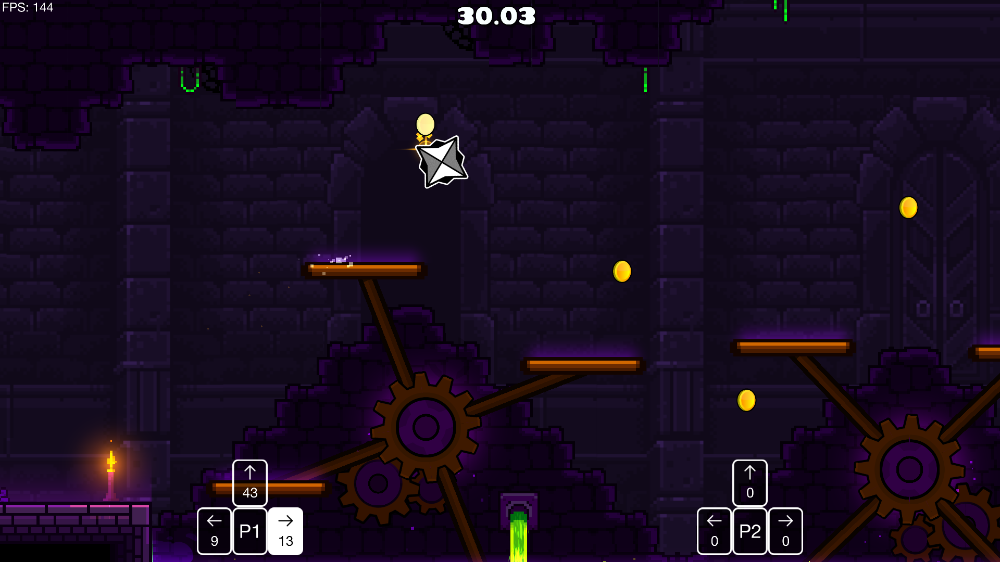

# Inputs Viewer

Inspired by the Key Viewer feature in [ADOFAI Tweaks](https://github.com/PizzaLovers007/AdofaiTweaks). This mod adds an overlay that shows player inputs. Can be configured in the pause menu.\

# License

This project is licensed under the [GNU General Public License v3.0](https://choosealicense.com/licenses/gpl-3.0/), read more by clicking on the highlighted name.